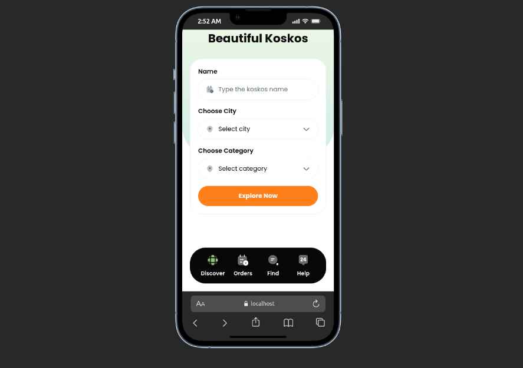

# KostKuy

KostKuy adalah platform digital untuk pencarian, pemesanan, dan review kost/boarding house secara online. Project ini dibangun menggunakan Laravel, Tailwind CSS, dan Filament untuk kebutuhan backend dan frontend.

## Fitur Utama
- Pencarian kost berdasarkan kota, kategori, dan harga
- Detail kost lengkap dengan foto, bonus, fasilitas, dan review
- Pemesanan kamar secara online
- Sistem review dan rating
- Dashboard admin untuk pengelolaan data

## Struktur Project
- Backend: Laravel
- Frontend: Blade + Tailwind CSS
- Admin: Filament

## Tampilan

## Cara Menjalankan
1. Clone repository
2. Install dependency: `composer install` dan `npm install`
3. Copy `.env.example` ke `.env` dan sesuaikan konfigurasi database
4. Jalankan migrasi: `php artisan migrate --seed`
5. Build asset: `npm run build`
6. Jalankan server: `php artisan serve`

## Kontribusi
Silakan buat pull request atau issue untuk saran dan perbaikan.

---

**KostKuy** membantu kamu menemukan kost terbaik dengan mudah dan cepat!